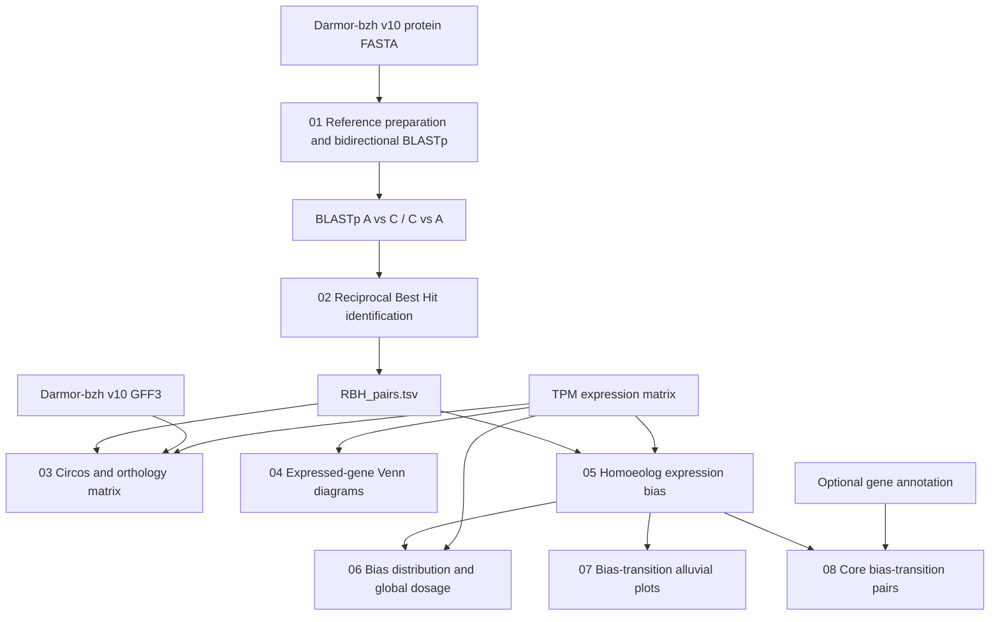

# *Brassica napus* homoeolog expression bias workflow

This repository contains the analysis workflow used to identify BnA–BnC homoeologous gene pairs in *Brassica napus* cv. Darmor-bzh v10 and to evaluate subgenome-specific expression and homoeolog expression bias (HEB) using TPM-normalized RNA-seq data.

The workflow combines Reciprocal Best Hit (RBH) identification, expression filtering, chromosome-scale visualization, homoeolog expression bias classification, transcriptomic dosage analysis, bias-transition visualization, and identification of core homoeologous pairs with bias changes across lineages/genotypes.

## Workflow overview



Scripts 01–02 define BnA–BnC RBH pairs. Script 03 visualizes expressed RBH pairs. Script 04 is an independent expression-overlap analysis based on BnA and BnC gene identifiers in the TPM matrix. Scripts 05–08 use the RBH-based homoeolog pairs for HEB and downstream analyses.

## Repository structure

```text
Bnapus-homeolog-expression-bias/
├── README.md
├── .gitignore
└── scripts/
    ├── 01_prepare_reference_and_BLAST.sh
    ├── 02_identify_RBH.R
    ├── 03_circos_RBH_expression.R
    ├── 04_venn_expressed_homeologs.R
    ├── 05_homeolog_expression_bias.R
    ├── 06_bias_distribution_and_dosage.R
    ├── 07_bias_transitions_alluvial.R
    └── 08_core_bias_transition_pairs.R
```

Input data, reference files, intermediate files, and generated results are intentionally not tracked by Git.

## Reference genome

The workflow was developed using the *Brassica napus* cv. Darmor-bzh v10 reference.

The required reference files are available from BnaOmics:

https://bnaomics.ocri-genomics.net/download/public/reference-genome-sequences-and-gene-annotation/B_napus_cv_Darmor_bzh/v10/

Required files:

```text
BnapusDarmor-bzh_proteins.fasta.gz
BnapusDarmor-bzh_annotation.gff.gz
```

Place these files in a local `reference/` directory when using the default paths.

The reference files are not distributed in this repository.

## Requirements

### Command-line software

Script 01 requires:

- Bash
- NCBI BLAST+ (`blastp` and `makeblastdb`)
- `pv`

On macOS with Homebrew, these can be installed with:

```bash
brew install blast
brew install pv
```

### R packages

The R scripts use the following packages:

```r
install.packages(c(
  "tidyverse",
  "openxlsx",
  "circlize",
  "readxl",
  "writexl",
  "RColorBrewer",
  "ggVennDiagram",
  "scales",
  "ggalluvial",
  "pheatmap"
))
```

Individual scripts only load the packages needed for that analysis.

## Input expression matrix

Scripts 03–06 require a TPM-normalized expression matrix in Excel format (`.xlsx`).

The first column must contain Darmor-bzh v10 gene identifiers. The scripts rename this first column internally to `GeneID` or `gene.id`, so its original column name is not important.

A simplified example is:

```text
GeneID       Line1_U_rep1  Line1_U_rep2  Line1_U_rep3  Line1_P_rep1  Line1_P_rep2  Line1_P_rep3
A01gXXXXX.1  12.4          11.8          13.1          18.5          17.9          19.2
C01gXXXXX.1   7.2           6.9           7.5           9.1           8.8           9.4
```

### Sample naming

Sample columns must begin with the lineage/genotype name defined in each script:

```r
lineages <- c("Line1", "Line2", "Line3")
```

For example:

```text
Line1_U_rep1
Line1_U_rep2
Line1_U_rep3
Line1_P_rep1
Line1_P_rep2
Line1_P_rep3
```

By default:

- `_U` identifies Unprimed samples.
- `_P` identifies Primed samples.

These patterns can be changed in the scripts if a different naming convention is used.

Names such as `rep1_Line1` will not be selected by scripts that use the lineage name as a column prefix.

For the paired HEB test in script 05, BnA and BnC expression values are compared within the same biological samples. Missing values are removed pairwise before the paired test.

## Running the workflow

Run the scripts from the repository root unless custom paths are supplied through environment variables.

The commands below assume:

```text
reference/
    BnapusDarmor-bzh_proteins.fasta.gz
    BnapusDarmor-bzh_annotation.gff.gz

data/
    tpm_counts.xlsx
```

The `reference/`, `data/`, and `results/` directories are ignored by Git and remain local.

---

## 01 — Reference preparation and bidirectional BLASTp

```text
scripts/01_prepare_reference_and_BLAST.sh
```

This script:

1. decompresses the Darmor-bzh v10 protein FASTA;
2. separates BnA and BnC sequences according to FASTA identifiers;
3. retains sequences matching the `.1` isoform;
4. creates separate BLAST protein databases;
5. performs BnA → BnC and BnC → BnA BLASTp searches.

Default paths:

```text
REFERENCE_DIR=./reference
WORK_DIR=./Homologous_Analysis_DarmorV10
NUM_THREADS=8
```

Run:

```bash
bash scripts/01_prepare_reference_and_BLAST.sh
```

To override the defaults:

```bash
REFERENCE_DIR=/path/to/reference \
WORK_DIR=/path/to/workdir \
NUM_THREADS=8 \
bash scripts/01_prepare_reference_and_BLAST.sh
```

Main outputs:

```text
Homologous_Analysis_DarmorV10/results/A_vs_C.tsv
Homologous_Analysis_DarmorV10/results/C_vs_A.tsv
```

---

## 02 — Reciprocal Best Hit identification

```text
scripts/02_identify_RBH.R
```

This script identifies BnA–BnC RBH pairs from the bidirectional BLASTp results.

The analysis:

- retains hits with sequence identity ≥ 70%;
- selects the highest-bitscore hit for each query;
- identifies reciprocal best hits between BnA and BnC;
- exports best hits, RBH pairs, and summary statistics.

Run:

```bash
Rscript scripts/02_identify_RBH.R
```

Main outputs:

```text
Homologous_Analysis_DarmorV10/results/Final_results/
├── Best_hits_A_vs_C.tsv
├── Best_hits_C_vs_A.tsv
├── RBH_pairs.tsv
├── RBH_summary.tsv
├── RBH_pipeline_description.txt
└── Excel/
    └── RBH_results.xlsx
```

The RBH table used by downstream analyses contains at least:

```text
gene_A
gene_C
pident
bitscore
evalue
RBH
```

---

## 03 — Expression-filtered RBH Circos plots and orthology matrix

```text
scripts/03_circos_RBH_expression.R
```

This script combines:

- `RBH_pairs.tsv`;
- the Darmor-bzh v10 GFF3 annotation;
- the TPM expression matrix.

For each lineage/genotype, it retains RBH pairs for which both homoeologs are expressed and located on the main BnA/BnC chromosomes.

The script generates:

- a circular synteny plot using buffered links;
- a circular synteny plot using the original gene coordinates;
- an orthology matrix showing the number of expressed RBH pairs for each BnA–BnC chromosome combination;
- an Excel table containing the expressed RBH pairs.

Default input paths include:

```text
./reference/BnapusDarmor-bzh_annotation.gff.gz
./Homologous_Analysis_DarmorV10/results/Final_results/RBH_pairs.tsv
```

The TPM path can be provided explicitly:

```bash
TPM_PATH=./data/tpm_counts.xlsx \
Rscript scripts/03_circos_RBH_expression.R
```

The lineage names must be edited in the script if they differ from:

```r
lineages <- c("Line1", "Line2", "Line3")
```

---

## 04 — Venn diagrams of expressed BnA and BnC genes

```text
scripts/04_venn_expressed_homeologs.R
```

This script identifies genes with TPM ≥ 1 in at least one sample of each lineage and generates separate Venn diagrams for BnA and BnC genes.

Run:

```bash
TPM_FILE=./data/tpm_counts.xlsx \
Rscript scripts/04_venn_expressed_homeologs.R
```

Outputs:

```text
results/Venn_expressed_genes/
├── Venn_Subgenome_A_TPM.png
└── Venn_Subgenome_C_TPM.png
```

> **Important:** this script separates genes according to BnA/BnC gene identifiers in the TPM matrix and does **not** restrict the analysis to the RBH pairs identified by script 02. It therefore represents overlap among expressed BnA and BnC genes, rather than overlap among RBH-filtered homoeologous pairs.

> **Note:** the Venn diagram script is currently optimized and color-coded for comparing exactly 3 lineages/genotypes.

---

## 05 — Homoeolog Expression Bias analysis

```text
scripts/05_homeolog_expression_bias.R
```

This is the main HEB calculation step.

For each lineage/genotype, the script:

1. selects Unprimed and Primed samples;
2. matches BnA and BnC genes using `RBH_pairs.tsv`;
3. retains homoeologous pairs with detectable expression;
4. calculates mean BnA and BnC TPM;
5. calculates:

```text
log2((Mean_A + 1) / (Mean_C + 1))
```

6. performs a paired Student's t-test on `log2(TPM + 1)` values from corresponding BnA and BnC measurements;
7. applies Benjamini–Hochberg multiple-testing correction;
8. classifies pairs as `A bias`, `C bias`, or `No bias`;
9. records whether the classification is `Stable` or `Changed` between Unprimed and Primed conditions.

Default thresholds:

```r
bias_lfc_cutoff <- 1
p_adj_cutoff <- 0.05
```

Thus:

```text
A bias:  log2FC >  1 and FDR < 0.05
C bias:  log2FC < -1 and FDR < 0.05
No bias: all other cases
```

Run:

```bash
RBH_FILE=./Homologous_Analysis_DarmorV10/results/Final_results/RBH_pairs.tsv \
TPM_FILE=./data/tpm_counts.xlsx \
Rscript scripts/05_homeolog_expression_bias.R
```

Main outputs:

```text
results/Homeolog_expression_bias/
├── Bias_Analysis_Line1.xlsx
├── Bias_Analysis_Line2.xlsx
└── Bias_Analysis_Line3.xlsx
```

Each workbook contains the HEB statistics and the transition classification used by scripts 06–08.

---

## 06 — Bias distribution and global transcriptomic dosage

```text
scripts/06_bias_distribution_and_dosage.R
```

This script generates two complementary analyses.

### Bias distribution

The histograms use the `LFC_UP` and `LFC_P` values calculated by script 05. The log2 ratios are therefore not recalculated in this step.

The histograms display the distribution of:

```text
log2(Expression_A / Expression_C)
```

and color the observations according to `A bias`, `C bias`, or `No bias`.

The script also compares the numbers of A-biased and C-biased pairs within each condition using a chi-squared test.

### Global transcriptomic dosage

Global transcriptomic dosage is calculated independently from the RBH-filtered data.

For every biological sample:

```text
BnA proportion = total TPM of BnA genes / (total BnA TPM + total BnC TPM)
BnC proportion = total TPM of BnC genes / (total BnA TPM + total BnC TPM)
```

The complete TPM matrix is therefore required.

Run:

```bash
BIAS_DIR=./results/Homeolog_expression_bias \
TPM_FILE=./data/tpm_counts.xlsx \
Rscript scripts/06_bias_distribution_and_dosage.R
```

Main outputs include:

```text
results/Bias_distribution_and_dosage/
├── Bias_Distribution_Line1.png
├── Bias_Distribution_Line2.png
├── Bias_Distribution_Line3.png
├── Global_Transcriptomic_Dosage_Line1.png
├── Global_Transcriptomic_Dosage_Line2.png
├── Global_Transcriptomic_Dosage_Line3.png
├── Global_Transcriptomic_Dosage_Line1.xlsx
├── Global_Transcriptomic_Dosage_Line2.xlsx
├── Global_Transcriptomic_Dosage_Line3.xlsx
└── Summary_Bias_All_Lineages.xlsx
```

---

## 07 — Bias-transition alluvial plots

```text
scripts/07_bias_transitions_alluvial.R
```

This script visualizes transitions in HEB classification from Unprimed to Primed conditions.

It reads the bias classifications generated by script 05 and does not repeat the HEB statistical analysis.

Possible transitions include:

```text
A bias  -> A bias
A bias  -> C bias
A bias  -> No bias
C bias  -> A bias
C bias  -> C bias
C bias  -> No bias
No bias -> A bias
No bias -> C bias
No bias -> No bias
```

Pairs retaining the same bias state are labeled `Stable`; all other transitions are labeled `Changed`.

Run:

```bash
BIAS_DIR=./results/Homeolog_expression_bias \
Rscript scripts/07_bias_transitions_alluvial.R
```

Main outputs:

```text
results/Bias_transitions_alluvial/
├── Bias_Transitions_Alluvial_Line1.png
├── Bias_Transitions_Alluvial_Line2.png
├── Bias_Transitions_Alluvial_Line3.png
└── Bias_Transition_Summary_All_Lineages.xlsx
```

The summary workbook contains:

```text
Transition_Summary
Stable_vs_Changed
```

---

## 08 — Core bias-transition homoeologous pairs

```text
scripts/08_core_bias_transition_pairs.R
```

This is an optional downstream analysis for identifying homoeologous pairs whose bias classification changes between Unprimed and Primed conditions across all three lineages/genotypes.

The script:

1. extracts pairs classified as `Changed` in each lineage;
2. compares them using a Venn diagram;
3. identifies the intersection present in all lineages;
4. generates a heatmap of `LFC_UP` and `LFC_P` values for the core pairs;
5. calculates the magnitude of each transition:

```text
Delta_Lineage = |LFC_P - LFC_UP|
```

6. calculates `Mean_Delta`;
7. classifies the direction of change across lineages as `Consistent`, `Divergent`, or `Incomplete`;
8. exports candidate/core-pair tables.

Run:

```bash
BIAS_DIR=./results/Homeolog_expression_bias \
Rscript scripts/08_core_bias_transition_pairs.R
```

Optional annotation can be supplied with:

```bash
ANNOTATION_FILE=/path/to/DarmorV10_Final_Annotation.xlsx \
BIAS_DIR=./results/Homeolog_expression_bias \
Rscript scripts/08_core_bias_transition_pairs.R
```

If provided, the annotation file must contain:

```text
DarmorV10
All_Uniprot_Prot
```

Main outputs include:

```text
results/Core_bias_transitions/
├── Venn_Changed_Homoeologous_Pairs.png
├── Heatmap_Core_Bias_Transition_Pairs.png
├── Changed_Pairs_and_Core_Intersection.xlsx
└── Candidate_Core_Homoeologous_Pairs.xlsx
```

If no common changed pairs are identified, the heatmap and candidate table are skipped.

> **Note:** script 08 is currently designed for exactly 3 lineages/genotypes for Venn visualization and downstream core-intersection analysis.

## Dependency between scripts

The scripts do not all need to be run strictly from 01 to 08.

The main dependencies are:

```text
01 -> 02

02 + GFF + TPM -> 03

TPM -> 04

02 + TPM -> 05

05 + TPM -> 06

05 -> 07

05 -> 08
```

Therefore, scripts 06–08 can be run independently after script 05 has generated the `Bias_Analysis_<Lineage>.xlsx` files.

## Environment variables

Most file paths can be overridden without editing the scripts.

Variables used across the workflow include:

```text
REFERENCE_DIR
WORK_DIR
NUM_THREADS
TPM_PATH
TPM_FILE
RBH_FILE
BIAS_DIR
ANNOTATION_FILE
OUT_DIR
OUTPUT_DIR
```

Example:

```bash
TPM_FILE=/absolute/path/to/tpm_counts.xlsx \
RBH_FILE=/absolute/path/to/RBH_pairs.tsv \
OUTPUT_DIR=/absolute/path/to/results/Homeolog_expression_bias \
Rscript scripts/05_homeolog_expression_bias.R
```

The lineage names and condition patterns are currently defined inside the R scripts and should be edited there when necessary.

## Important notes and limitations

- Gene identifiers are expected to follow the Darmor-bzh v10 naming convention used by the reference files.
- BnA genes are identified by IDs beginning with `A`; BnC genes are identified by IDs beginning with `C`.
- Script 01 retains protein FASTA entries matching `.1` after subgenome separation.
- Script 02 uses a minimum BLAST sequence identity of 70% and selects the highest-bitscore hit for each query before identifying reciprocal hits.
- Script 04 evaluates expressed BnA/BnC genes directly from the TPM matrix; it is not restricted to RBH pairs.
- Script 04 is currently optimized and color-coded for exactly 3 lineages/genotypes.
- Scripts 05–08 assume sample-column names begin with the lineage/genotype prefix.
- Scripts 05–06 use `_U` and `_P` by default to distinguish Unprimed and Primed samples.
- HEB is defined using `|log2FC| > 1` together with Benjamini–Hochberg-adjusted `P < 0.05`.
- Script 05 uses a paired Student's t-test on `log2(TPM + 1)` values and removes missing observations pairwise.
- Script 06 calculates global transcriptomic dosage from the complete TPM matrix rather than only from RBH-filtered pairs.
- Script 08 is currently designed for exactly 3 lineages/genotypes.
- The optional annotation used by script 08 is not required to identify the core intersection.

## Data availability

Raw RNA-seq data and TPM matrices are not distributed with this repository.

The reference genome/proteome and annotation should be downloaded independently from BnaOmics using the source listed above.

Users should provide their own TPM-normalized expression matrix following the input format and sample-naming conventions described in this README.

## Citation

If you use this workflow, please cite the associated publication.

Publication details will be added upon publication.

## Contact

For questions about the workflow, please use the GitHub repository issue tracker.
